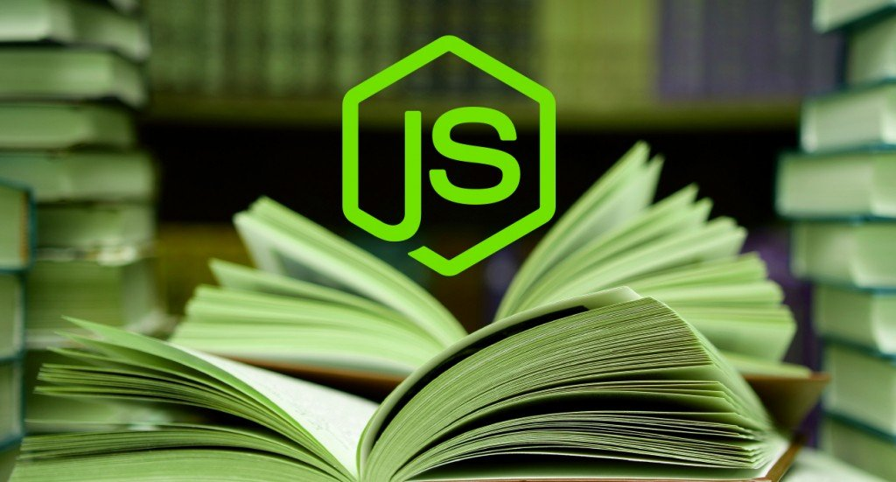

<h1 align="center">
   
  
   
     
        Livraria
   
</h1>
<h2 align="center">
  
Letícia Desiderio 

</h2>

# Objetivo
Mostrar o que aprendemos durante essas cincos semanas dentro da Reprograma, criar nosso primeiro projeto em cima daquilo que foi apresentado. Sendo assim, 
conseguir construir uma sintaxe correta, elaborando uma boa lógica.

---
## Liguagem & Software: 

- JavaScript
- Node.js

## Revisão

Estamos na quinta semana, aprendemos muitas coisas novas até aqui com a Reprograma, revisamos e reforçamos o conteúdo de Javascrit e ES6.

Revisamos:

1. `Variáveis`
2. `String X Template string`
3. `Function X Arrow function`
4. `Função Callbac`
5. `Conditional if...else X Ternary operator`
6. `Objetos`
7. `Classes`
8. `Arrays`
9. `Métodos de iteração`

---

## Projeto

Criamos nosso primeiro projeto, onde foi proposto pensarmos em algo real. Algo que utilizamos muito no nosso dia a dia.
Assim, podemos treinar e evoluir nosso conhecimento. 

Esse projeto é um tema pedido em etapas técnicas nas seleções de algumas empresas. 

> Vamos criar um sistema que armazena informações de livros para que seja possível gerenciar:
  - os livros que já lemos e os livros que estão na nossa listinha de desejos
 

.

.

 

img

# Tenho certeza que apredemos muito e estamos dispostos a compartilhar nossa jornada até aqui! 

##  E contem comigo! 
  Onde vocês me encontram:
  - [Linkedin](https://www.linkedin.com/in/let%C3%ADcia-desiderio-65a5171b8/)
  - [Instagram](https://www.instagram.com/letidesiderio/)
