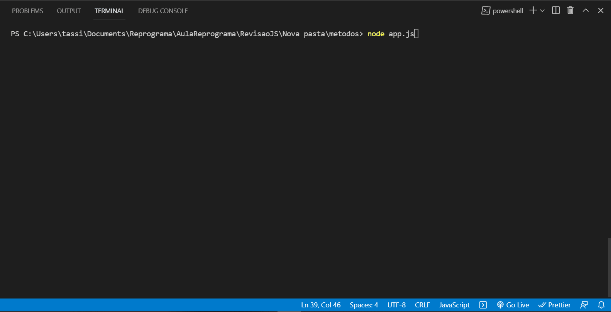

<h1 align="center">
   
  
   
     
        Semana 5
   
</h1>
<h2 align="center">
  
{Profa} Tassi Bomfim 

</h2>

# Revisão e Projeto Prático

---

## Revisão

Estamos na quinta semana, aprendemos muitas coisas novas até aqui (saudades mana Keyla), por esse motivo vamos parar e respirar - Vocês já perceberam o tanto de coisas novas que aprenderam até aqui?! Vamos rever e reforçar o conteúdo de Javascrit e ES6.

Vamos revisar:

1. `Variáveis`
2. `String X Template string`
3. `Function X Arrow function`
4. `Função Callbac`
5. `Conditional if...else X Ternary operator`
6. `Objetos`
7. `Classes`
8. `Arrays`
9. `Métodos de iteração`

---

## Projeto

Trago uma super proposta manas. 

Vamos criar nosso primeiro projeto já pensando em algo real.  Algo que utilizamos muito no nosso dia a dia.

E aqui pra nós, esse projeto é um tema pedido em etapas técnicas nas seleções de algumas empresas. 

> Vamos criar um sistema que armazena informações de livros para que seja possível gerenciar:
  - os livros que já lemos e os livros que estão na nossa listinha de desejos
 

.

.

 

# Tenho certeza que vocês vão arrasar! 

## Dicas: 

- Tenham calma, vocês já possuem todos os conhecimentos necessários para realizar o projeto.
- Não queira ver o fluxo todo de imediato! Um passo de cada vez, primeiro resolve um ponto e depois passe para o passo seguinte.
- Não existe apenas uma resposta certa.
- Se esqueceu de algum metódo ou o que ele realmente faz? Consulte o google, veja exemplos e leia a documentação.
- Leia o erro que está dando no seu terminal ou na propria linha de comando 
- Juntem-se para trocar figurinhas.

##  E contem comigo! 
  Onde vocês me encontram:
  - [Linkedin](https://www.linkedin.com/in/tassilabomfim/)
  - [Instagram](https://www.instagram.com/tassilabomfim/)
